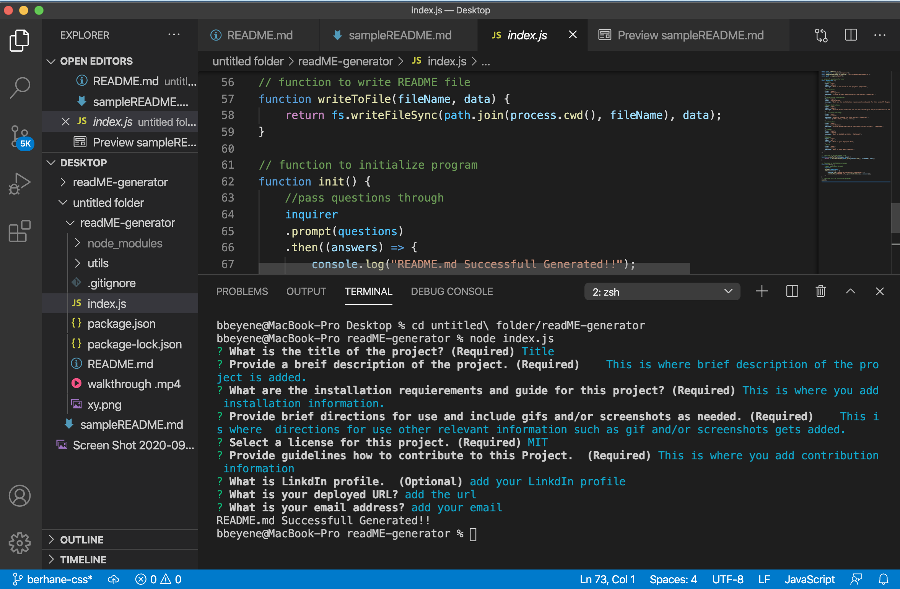

# README Generator
   ## Description
      This application is developed to help project developers to save time in generating thier README.md markdown.
   ## Table of Contents
   * [Installation Instructions](#installation-instructions)
   
   * [Usage Instructions](#usage-instructions)
   
   * [Contribution](#Contribution)
   
   * [Developers Contact Information](#Developers-Contact-Information)
     
* [License](#license)

   ## Installation Instructions
   The developer is authorizing a free installation by cloning from the code [Bbeyenene/readME-generator](https://github.com/Bbeyenene/readME-generator).
   ## Usage Instructions
   1. Copy the code from the code [Bbeyenene/readME-generator](https://github.com/Bbeyenene/readME-generator) and clone it in your in your comand line.
   2. Make sure node and npm is installed in your computer.
   3. Once in the directory run npm install to install the node_modules needed to run the app.
   4. Run node index.js 
   5. You will be prompted with questions.
   6. A "README.md Successfull Generated!!" will be desplayed after answering all the questions.
   7. Your README.md is in your repo enjoy it!!!!!!
   
   Click the demo image to see video demonstration:
   

   ## Contributiion
   There is no need for contribution at this time.
   
   ## Developers Contact Information
    * LinkdIn Profile: [Berhane](https://www.linkedin.com/in/berhane-beyene/)
    * URL : N/A
    * Email: monoxica2004@yahoo.com
   ## License
    ### This application is licensed under .
  